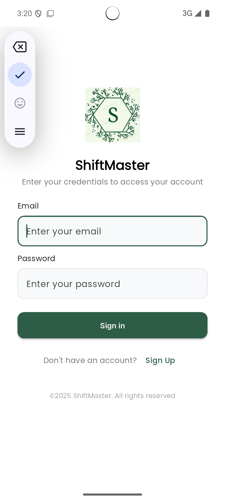
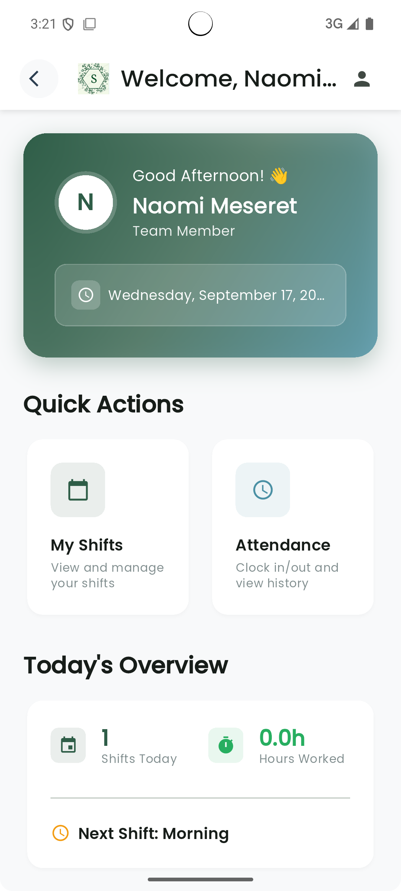
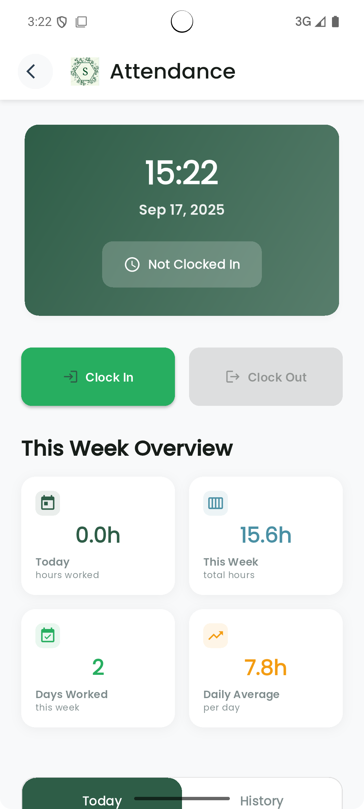
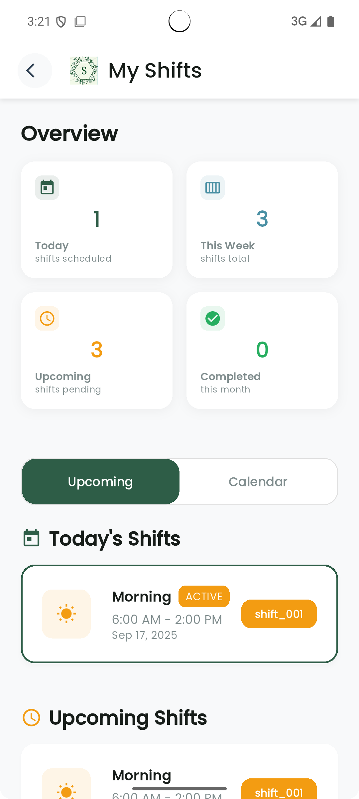
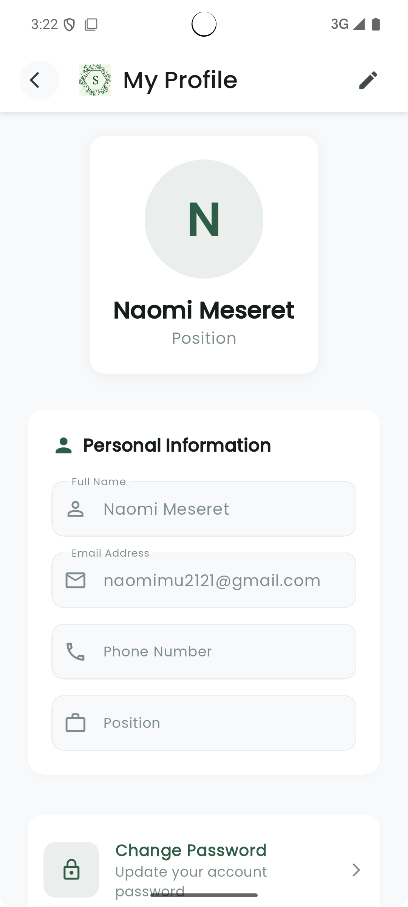
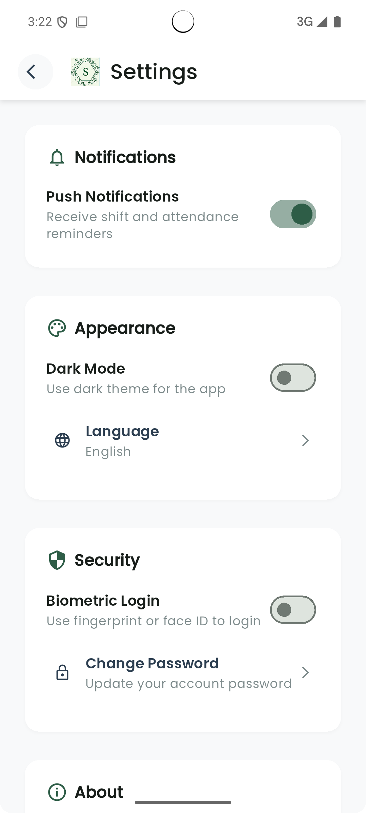
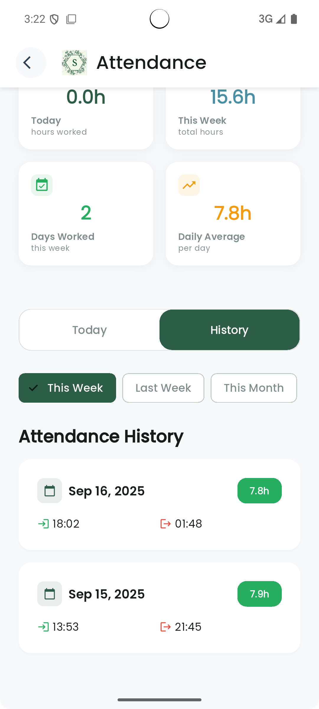
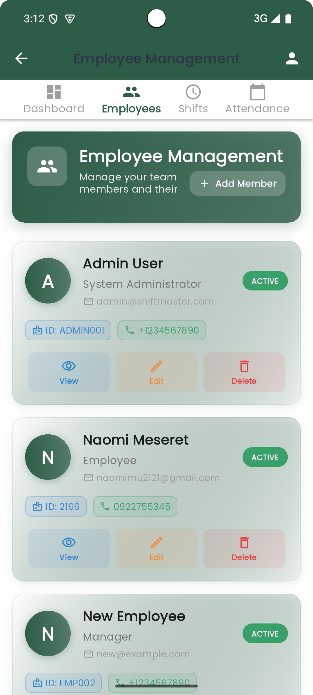
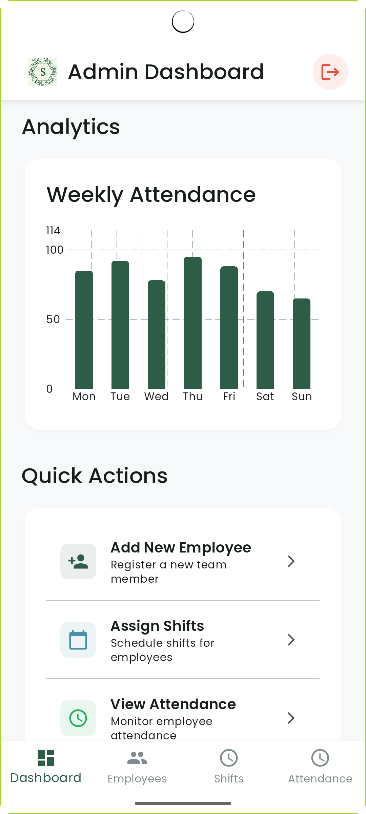
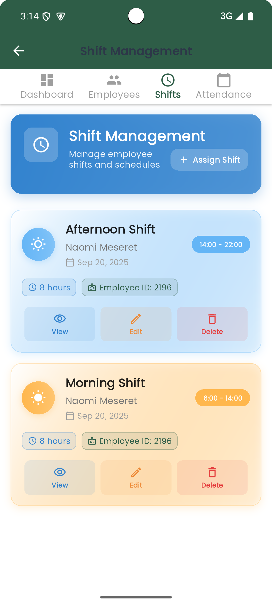

# 🚀 ShiftMaster - Employee Shift Management System

[](https://flutter.dev)
[](https://nodejs.org)
[](https://mongodb.com)
[](https://riverpod.dev)
[](https://expressjs.com)
[](https://jwt.io)

> **A practical employee shift management app built with Flutter and Node.js. Employees can easily track attendance and view shifts, while admins can manage employees and assign shifts. Simple, efficient, and user-friendly.**

## 🎯 Project Overview

This practical mobile application demonstrates **cross-platform mobile development**, **backend API design**, and **database management**. Built with **Clean Architecture** principles, it focuses on essential workforce management features without unnecessary complexity.

## 📱 Application Screenshots

### Core User Interfaces
| Login & Authentication | Employee Home Dashboard | Attendance Tracking | Shift Management |
|------------------------|-------------------------|-------------------|------------------|
|  |  |  |  |

### Employee Features
| Profile Management | Settings & Preferences | Team Directory | Attendance History |
|-------------------|----------------------|----------------|-------------------|
|  |  |  |  |

### Admin Features
| Admin Dashboard | Employee Management | Analytics & Reports | Shift Assignment |
|-----------------|-------------------|-------------------|------------------|
|  |  |  |  |

## ✨ Key Features

### 🔐 **Authentication & User Management**
- **Secure Registration** with admin approval workflow
- **JWT Authentication** with role-based access control (Admin/Employee)
- **Password Encryption** using bcrypt with salt rounds
- **Input Validation** and comprehensive sanitization
- **Session Management** with automatic token refresh
- **User Profile Management** with editable information
- **Logout Functionality** with secure token invalidation

### 👨‍💼 **Administrative Features**
- **Employee Management** - Approve/reject registrations, manage user accounts
- **Shift Assignment** - Create and assign shifts to employees
- **User Approval System** - Review and process new employee registrations
- **Employee Overview** - View all employees and their basic information
- **Simple Dashboard** - Clean interface focused on essential admin tasks

### 👤 **Employee Experience**
- **Professional Dashboard** - Personalized greeting with time-based messages
- **Real-time Clock In/Out** - Simple attendance tracking with accurate time calculation
- **Shift Management** - Interactive calendar and list views of assigned shifts
- **Attendance History** - Detailed records with filtering (This Week/Month/Custom)
- **Profile Management** - Update personal information and change passwords
- **Weekly Statistics** - Total hours, days worked, and daily averages
- **Quick Actions** - Easy navigation to frequently used features

### 📅 **Advanced Shift Management**
- **Interactive Calendar** - TableCalendar integration with color-coded shifts
- **Dual View Toggle** - Switch between upcoming shifts and calendar view
- **Shift Types** - Morning, Afternoon, Evening, and Night shifts with distinct colors
- **Comprehensive Statistics** - Shift coverage and employee workload analytics
- **Pull-to-Refresh** - Real-time data synchronization
- **Error Handling** - Proper empty states and error messages

### ⏰ **Attendance Tracking System**
- **Real-time Clock Operations** - Accurate time tracking with live status updates
- **Today's Summary** - Current shift status and hours worked display
- **Historical Records** - Comprehensive attendance history with smart filtering
- **Period Filters** - This Week, Last Week, This Month, Last Month options
- **Statistical Analysis** - Weekly totals, averages, and performance metrics
- **Hours Calculation** - Precise time calculation with proper formatting

### 🎨 **Modern UI/UX Design**
- **Material Design 3** - Latest design system with adaptive components
- **Poppins Typography** - Professional font family throughout the app
- **Responsive Design** - Optimized for all screen sizes and orientations
- **Professional Color Scheme** - Consistent branding with gradient backgrounds
- **Smooth Animations** - Polished transitions and micro-interactions
- **Accessibility Features** - Screen reader support and inclusive design

## 🏗️ Architecture

### **Frontend (Flutter)**
```
lib/
├── application/          # Business logic layer
│   └── services/        # Services (validation, notifications)
├── config/              # App configuration and themes
├── domain/              # Domain entities and models
├── infrastructure/      # External services and APIs
└── presentation/        # UI layer
    ├── screens/         # App screens
    ├── widgets/         # Reusable UI components
    └── states/          # State management (Riverpod)
```

### **Backend (Node.js)**
```
backend/
├── models/              # MongoDB schemas
├── routes/              # API endpoints
├── utils/               # Database connection and utilities
├── middleware/          # Authentication and validation
└── tests/               # API tests
```

## 🛠️ Technical Implementation

### **Frontend Architecture (Flutter)**
```dart
// Clean Architecture with Riverpod State Management
lib/
├── domain/              # Business logic & entities
├── infrastructure/      # Data sources & repositories  
├── presentation/        # UI layer with state management
└── config/             # App configuration & themes
```

**Key Technologies:**
- **Flutter 3.19+** - Cross-platform mobile framework
- **Riverpod 2.0** - Advanced state management with providers
- **Material Design 3** - Modern adaptive UI components
- **HTTP & Dio** - RESTful API communication
- **Intl** - Internationalization and date formatting
- **Clean Architecture** - Separation of concerns

### **Backend Architecture (Node.js)**
```javascript
// RESTful API with Express.js
backend/
├── models/             # MongoDB schemas (Employee, Shift, Attendance)
├── routes/             # API endpoints & controllers
├── utils/              # Database connection & utilities
└── middleware/         # Authentication & validation
```

**Key Technologies:**
- **Node.js 18+** - JavaScript runtime environment
- **Express.js 4.18** - Web application framework
- **MongoDB 6.0** - NoSQL document database
- **Mongoose 7.0** - ODM for MongoDB
- **JWT** - Stateless authentication
- **bcrypt** - Password hashing with salt
- **CORS** - Cross-origin resource sharing

### **Development Practices**
- **Clean Architecture** - Domain-driven design principles
- **SOLID Principles** - Maintainable and scalable code
- **Repository Pattern** - Data access abstraction
- **Provider Pattern** - Dependency injection with Riverpod
- **Error Handling** - Comprehensive exception management
- **Input Validation** - Server-side and client-side validation

## 🚀 Quick Start Guide

### 📋 Prerequisites
- **Flutter SDK** (3.19 or higher)
- **Node.js** (18 or higher) 
- **MongoDB** (6.0 or higher - local installation or MongoDB Atlas)
- **Development IDE** (Android Studio, VS Code, or IntelliJ)
- **Git** for version control

### ⚡ Fast Setup (5 Minutes)

#### 1. **Clone and Navigate**
```bash
git clone https://github.com/your-username/Employee_shift_management_flutter.git
cd Employee_shift_management_flutter
```

#### 2. **Backend Configuration**
```bash
cd backend
npm install

# Create environment file
echo "PORT=3000
MONGODB_URI=mongodb://localhost:27017/shiftmaster
JWT_SECRET=your_super_secret_jwt_key_here
NODE_ENV=development
BCRYPT_ROUNDS=12" > .env

# Start the server
npm start
```

#### 3. **Frontend Setup**
```bash
cd ../frontend
flutter pub get
flutter run
```

#### 4. **Test Accounts**
**Admin Account:**
- Email: `admin@shiftmaster.com`
- Password: `admin123`

**Employee Account:**
- Email: `naomimu2121@gmail.com` 
- Password: Use registration password

### 🎯 Verification Steps
1. **Backend**: Visit `http://localhost:3000/api/employees` - should return JSON
2. **Frontend**: App should launch and show login screen
3. **Database**: MongoDB should show `shiftmaster` database with collections
4. **Login**: Test with provided credentials

## 📁 Project Architecture

```
Employee_shift_management_flutter/
├── 📂 backend/                    # Node.js Express REST API
│   ├── 📂 models/                # MongoDB schemas and data models
│   │   ├── 📄 Employee.js        # Employee model with authentication
│   │   ├── 📄 Shift.js           # Shift scheduling model
│   │   └── 📄 Attendance.js      # Attendance tracking model
│   ├── 📂 routes/                # API endpoints and controllers
│   │   ├── 📄 employees.route.js # Employee CRUD operations
│   │   ├── 📄 auth.route.js      # Authentication endpoints
│   │   └── 📄 attendance.route.js# Attendance management
│   ├── 📂 utils/                 # Utilities and configurations
│   │   ├── 📄 connect.db.js      # MongoDB connection setup
│   │   └── 📄 auth.middleware.js # JWT authentication middleware
│   ├── 📄 .env.example           # Environment variables template
│   ├── 📄 index.js               # Express server entry point
│   └── 📄 package.json           # Dependencies and scripts
├── 📂 frontend/                   # Flutter cross-platform app
│   ├── 📂 lib/
│   │   ├── 📂 config/            # App configuration and themes
│   │   │   ├── 📄 app_theme.dart # Material Design 3 theming
│   │   │   └── 📄 constants.dart # App-wide constants
│   │   ├── 📂 domain/            # Business logic layer
│   │   │   └── 📂 entities/      # Data models and entities
│   │   ├── 📂 infrastructure/    # External services integration
│   │   │   └── 📂 repositories/  # Data access layer
│   │   └── 📂 presentation/      # UI and state management
│   │       ├── 📂 screens/       # App screens and pages
│   │       ├── 📂 widgets/       # Reusable UI components
│   │       └── 📂 states/        # Riverpod state providers
│   ├── 📂 android/               # Android platform configuration
│   ├── 📂 ios/                   # iOS platform configuration
│   └── 📄 pubspec.yaml           # Flutter dependencies
├── 📂 docs/                      # Comprehensive documentation
│   ├── 📄 USER_GUIDE.md          # Complete user manual
│   └── 📄 API_REFERENCE.md       # API documentation
└── 📄 README.md                  # This comprehensive overview
```

## 📚 Complete Documentation Suite

| Document | Description | Status |
|----------|-------------|--------|
| [👤 User Guide](docs/USER_GUIDE.md) | Comprehensive user manual for all features | ✅ Ready |
| [🔗 API Documentation](API_DOCUMENTATION.md) | Full REST API reference with examples | ✅ Ready |

## 🎯 Complete User Workflows

### 📝 Employee Onboarding Process
1. **Registration**: Employee downloads app and completes detailed registration form
2. **Validation**: System validates input and creates account with "pending" status
3. **Admin Review**: Admin receives notification and reviews employee details
4. **Approval**: Admin approves/rejects registration from management dashboard
5. **Activation**: Approved employees receive confirmation and can login
6. **Profile Setup**: Employee completes profile information and preferences

### 📅 Daily Operations Workflow
1. **Morning Login**: Employee opens app and views personalized dashboard
2. **Shift Review**: Check today's assigned shifts and weekly schedule
3. **Clock In**: Use attendance screen to clock in at shift start time
4. **Work Period**: App tracks time and maintains active status
5. **Clock Out**: Clock out at shift end with automatic hours calculation
6. **Review**: View updated attendance statistics and weekly totals

### 👨‍💼 Admin Management
1. **Dashboard**: Admin sees overview of employees and system
2. **Approve Users**: Review and approve new employee registrations
3. **Manage Employees**: View and manage employee accounts
4. **Assign Shifts**: Create and assign shifts to employees
5. **Monitor**: Basic oversight of employee attendance

## 🔐 Security Features

- **Password Hashing** with bcrypt and salt
- **JWT Token Authentication** with expiration
- **Input Validation** and sanitization
- **Role-Based Access Control** (RBAC)
- **Admin Approval Workflow** for new users
- **Environment Variable Protection** for secrets
- **CORS Configuration** for API security

## 📊 Key Metrics & Analytics

- Employee count and status distribution
- Daily/weekly/monthly attendance rates
- Shift completion statistics
- Work hours tracking and reporting
- Real-time dashboard with charts

## 🧪 Comprehensive Testing Suite

### 📱 Frontend Testing
```bash
cd frontend

# Unit tests for business logic
flutter test

# Widget tests for UI components
flutter test test/widget_test.dart

# Integration tests for user flows
flutter drive --target=test_driver/app.dart
```

### 🔧 Backend Testing
```bash
cd backend

# API endpoint tests
npm test

# Database integration tests
npm run test:integration

# Authentication flow tests
npm run test:auth
```

### 🎯 Manual Testing Guide
**Complete testing procedures available in [Testing Guide](docs/TESTING_GUIDE.md)**
- **32 Detailed Test Cases** covering all features
- **Authentication Testing** (4 test cases)
- **Employee Dashboard Testing** (6 test cases) 
- **Attendance System Testing** (7 test cases)
- **Admin Features Testing** (5 test cases)
- **Integration & Performance Testing** (10 test cases)

### ✅ Test Coverage
- **Authentication**: Login, registration, admin approval
- **Attendance**: Clock in/out, time calculation, history
- **Shift Management**: Calendar view, shift assignment
- **Admin Dashboard**: User management, analytics
- **Error Handling**: Network issues, validation errors
- **UI/UX**: Responsive design, accessibility

## 📈 Performance Features

- **Optimized State Management** with Riverpod
- **Lazy Loading** for large data sets
- **Caching Strategy** for improved performance
- **Offline Support** for core features
- **Background Sync** for attendance data
- **Memory Management** optimization

## 🔧 Development Features

- **Clean Architecture** implementation
- **SOLID Principles** adherence
- **Comprehensive Testing** (Unit, Widget, Integration)
- **CI/CD Pipeline** ready
- **Code Documentation** with detailed comments
- **Error Handling** with user-friendly messages
- **Logging System** for debugging

## 🤝 Contributing

1. Fork the repository
2. Create your feature branch (`git checkout -b feature/AmazingFeature`)
3. Commit your changes (`git commit -m 'Add some AmazingFeature'`)
4. Push to the branch (`git push origin feature/AmazingFeature`)
5. Open a Pull Request


## 💼 Professional Development Showcase

### **🎯 Technical Skills Demonstrated**
- **Mobile Development**: Flutter app with Material Design 3 and responsive UI
- **Backend Development**: Node.js REST API with MongoDB database
- **State Management**: Riverpod for clean state management
- **Authentication**: JWT-based security with role-based access
- **Database Design**: MongoDB schemas for users, shifts, and attendance
- **Time Tracking**: Accurate attendance calculation and storage
- **Clean UI**: Simple, user-friendly interface design

### **🏗️ Software Engineering Best Practices**
- **Clean Architecture**: Domain-driven design with clear separation of concerns
- **SOLID Principles**: Maintainable, scalable, and testable code structure
- **Comprehensive Testing**: 32 detailed test cases covering all functionality
- **Error Handling**: Robust exception management with user-friendly feedback
- **Security Implementation**: Input validation, sanitization, and secure authentication
- **Documentation Excellence**: Complete user guides, API docs, and testing procedures
- **Production Readiness**: Environment configuration, deployment guides, and monitoring

### **📊 Project Highlights**
- **Practical Design**: Focused on essential workforce management features
- **User-Friendly**: Simple, intuitive interface for both employees and admins
- **Reliable**: Stable performance with proper error handling
- **Secure**: JWT authentication and secure data handling
- **Well-Documented**: Complete setup and user guides
- **Realistic**: Features that businesses actually need and use


### 🎓 **Skills Demonstrated in This Project**
- **Mobile**: Flutter, Dart, Material Design 3, Riverpod State Management
- **Backend**: Node.js, Express.js, RESTful APIs, JWT Authentication
- **Database**: MongoDB, Mongoose ODM, Schema Design
- **Architecture**: Clean Architecture, SOLID Principles, Domain-Driven Design
- **Security**: bcrypt, JWT, Input Validation, Role-Based Access Control
- **Testing**: Unit Tests, Widget Tests, Integration Tests, Manual Testing
- **Documentation**: Technical Writing, User Guides, API Documentation


---

⭐ **Star this repository if you find it helpful!**

