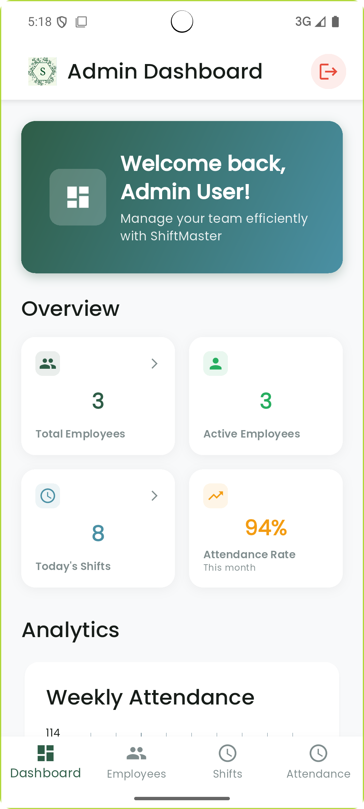

# ⏰ ShiftMaster - Employee Shift Management System

[](https://flutter.dev)
[](https://nodejs.org)
[](https://expressjs.com)
[](https://mongodb.com)
[](https://jwt.io)
[](https://m3.material.io)

> **A professional mobile application for managing employee shifts, attendance tracking, and workforce coordination. Built with Flutter and Node.js for reliability and performance.**

## 📋 **Project Overview**

ShiftMaster is a comprehensive workforce management solution designed to streamline employee scheduling and attendance tracking. The application features a clean, intuitive interface for both employees and administrators, making workforce management efficient and user-friendly.

**Key Benefits:**
- Simplifies employee scheduling and shift management
- Automates attendance tracking with real-time clock in/out
- Provides administrators with powerful management tools
- Offers employees easy access to their schedules and attendance records

## 📱 Application Screenshots

### 🔐 Authentication & Employee Dashboard

| Login Screen | Employee Dashboard | Profile Management | Settings |
| ------------ | ------------------ | ------------------ | -------- |
|  |  |  |  |

### ⏰ Employee Features

| Attendance Tracking | Shift Calendar | Attendance History |
| ------------------- | -------------- | ------------------ |
|  |  |  |

### 👨‍💼 Admin Features

| Admin Dashboard | Employee Management | Analytics & Reports | Shift Assignment |
| --------------- | ------------------- | ------------------- | ---------------- |
|  |  |  |  |

## ✨ **Key Features**

### 🔐 **Authentication & User Management**
- **Secure Registration** with admin approval workflow
- **JWT Authentication** with role-based access control (Admin/Employee)
- **Password Encryption** using bcrypt with salt rounds
- **User Profile Management** with editable information
- **Session Management** with automatic token refresh

### 👨‍💼 **Admin Dashboard**
- **Employee Management** - Add, edit, and manage employee accounts
- **User Approval System** - Review and approve new employee registrations
- **Shift Assignment** - Create and assign shifts to employees
- **Real-time Updates** - Live data synchronization across the platform
- **Analytics Overview** - Basic reporting and employee statistics

### 👤 **Employee Features**
- **Personal Dashboard** - Personalized home screen with shift overview
- **Attendance Tracking** - Easy clock in/out with accurate time calculation
- **Shift Calendar** - Interactive calendar view with color-coded shift types
- **Attendance History** - Detailed records with filtering options
- **Profile Management** - Update personal information and settings

### ⏰ **Attendance System**
- **Real-time Clock Operations** - Accurate time tracking with live status updates
- **Today's Summary** - Current shift status and hours worked display
- **Historical Records** - Comprehensive attendance history with smart filtering
- **Statistical Analysis** - Weekly totals, averages, and performance metrics
- **Hours Calculation** - Precise time calculation with proper formatting

### 🎨 **Modern Design**
- **Material Design 3** - Latest design system with adaptive components
- **Professional UI** - Clean, intuitive interface with gradient backgrounds
- **Responsive Design** - Optimized for all screen sizes
- **Enhanced Cards** - Beautiful employee and shift cards with status indicators

## 🏗️ Architecture

### **Frontend (Flutter)**

```
Flutter Mobile App
├── application/          # Business logic layer
│   └── services/        # Services (validation, notifications)
├── config/              # App configuration and themes
├── domain/              # Domain entities and models
├── infrastructure/      # External services and APIs
└── presentation/        # UI layer
    ├── screens/         # App screens
    ├── widgets/         # Reusable UI components
    └── states/          # State management (Riverpod)
```

### **Backend (Node.js)**

```
backend/
├── models/              # MongoDB schemas
├── routes/              # API endpoints
├── utils/               # Database connection and utilities
├── middleware/          # Authentication and validation
└── tests/               # API tests
```

## 🚀 Quick Start Guide

### 📋 Prerequisites

- **Flutter SDK** (3.19 or higher)
- **Node.js** (18 or higher)
- **MongoDB** (6.0 or higher - local installation or MongoDB Atlas)
- **Development IDE** (Android Studio, VS Code, or IntelliJ)

### ⚡ Fast Setup (5 Minutes)

#### 1. **Clone and Navigate**

```bash
git clone https://github.com/your-username/Employee_shift_management_flutter.git
cd Employee_shift_management_flutter
```

#### 2. **Backend Configuration**

```bash
cd backend
npm install

# Create environment file
echo "PORT=3000
MONGODB_URI=mongodb://localhost:27017/shiftmaster
JWT_SECRET=your_super_secret_jwt_key_here
NODE_ENV=development
BCRYPT_ROUNDS=12" > .env

# Start the server
npm start
```

#### 3. **Frontend Setup**

```bash
cd ../frontend
flutter pub get
flutter run
```

#### 4. **Test Accounts**

**Admin Account:**
- Email: `admin@shiftmaster.com`
- Password: `admin123`

**Employee Account:**
- Email: `naomimu2121@gmail.com`
- Password: Naomi2196

## 💼 Professional Development Showcase

### **🎯 Technical Skills Demonstrated**

- **Mobile Development** - Flutter app with Material Design 3 and responsive UI
- **Backend Development** - Node.js REST API with MongoDB database
- **State Management** - Riverpod for clean state management
- **Authentication** - JWT-based security with role-based access
- **Database Design** - MongoDB schemas for users, shifts, and attendance
- **Time Tracking** - Accurate attendance calculation and storage

### **🎯 Key Achievements**

- ✅ **Complete User Management** - Registration, approval, and role-based access
- ✅ **Advanced Shift System** - Visual calendar with color-coded shift types
- ✅ **Professional Admin Panel** - Enhanced employee and shift management
- ✅ **Attendance Tracking** - Accurate time calculation and reporting
- ✅ **Beautiful UI** - Gradient backgrounds, enhanced cards, and smooth animations
- ✅ **Production Ready** - Comprehensive error handling and data validation

### **🎓 Technical Skills Demonstrated**

- **Mobile Development** - Flutter, Dart, Material Design 3, Riverpod
- **Backend Development** - Node.js, Express.js, MongoDB, JWT Authentication
- **UI/UX Design** - Professional interface design with enhanced components
- **Database Design** - MongoDB schemas and data relationships
- **Security** - Password encryption, input validation, secure authentication
- **Architecture** - Clean Architecture, separation of concerns, maintainable code

---

<p align="center">
  <strong>⏰ Streamlining workforce management with modern technology.</strong>
</p>

<p align="center">
  Built with ❤️ for efficient workforce coordination
</p>

---

**⭐ Star this repository if you find it helpful and want to support workforce management innovation!**

**ShiftMaster represents a complete workforce management solution built with modern technologies and best practices. The application successfully demonstrates full-stack development capabilities while providing real business value through its comprehensive feature set.**
